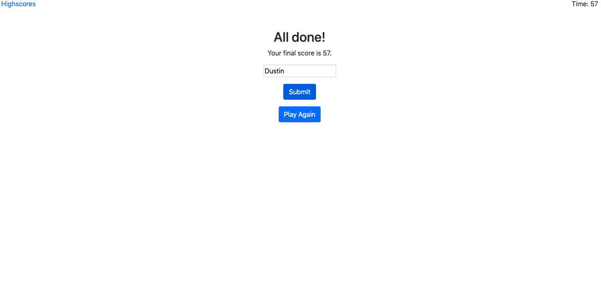

# country-capitals

## Description
The main goal of this project was to create a quiz by updating the DOM with javascript. As the user answers the questions, the DOM is updated with the next question. The user is given 60 seconds to complete the quiz. The remaining time left after completing the quiz is the user's final score. For every incorrect answer, the user loses 10 seconds. The user is prompted to enter their name. When the user enters his or her name this along with their score is entered into a highscores list. The highscores are sorted, so the highest score is at the top of the list, and the lowest at the bottom. The values are stored in local storage, so they are not lost.

##Pages
index - This is the main page. It describes to the user about the quiz and allows them to click start. It also allows them to navigate to the highscores page.

quiz - This page consists of the questions and multiple choice answers. When the user chooses an answer the DOM is updated with a new question until the quiz is complete. The time is displayed in the top right.

score - After the quiz is finished the user enters their name and can hit submit. There is also a play again button and they can navigate to the highscore page.

highscores - This page displays all of the highscores. There is a maximum of 5 scores allowed. They are sorted from the greatest to smallest. There is a clear button and a play again button.

##Future Endevers
1. Create a more appealing user interface
2. Highlight the correct answer afterwards
3. Randomly generate the order of questions and answers 
4. Add more questions to the quiz
5. Refactor and optimize code